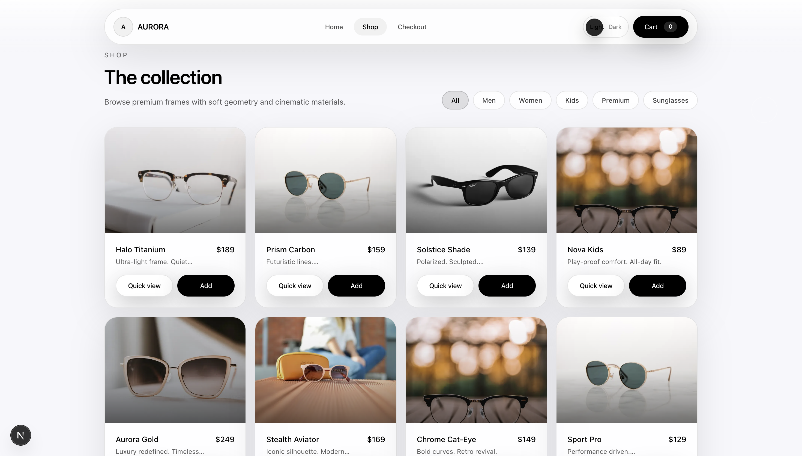
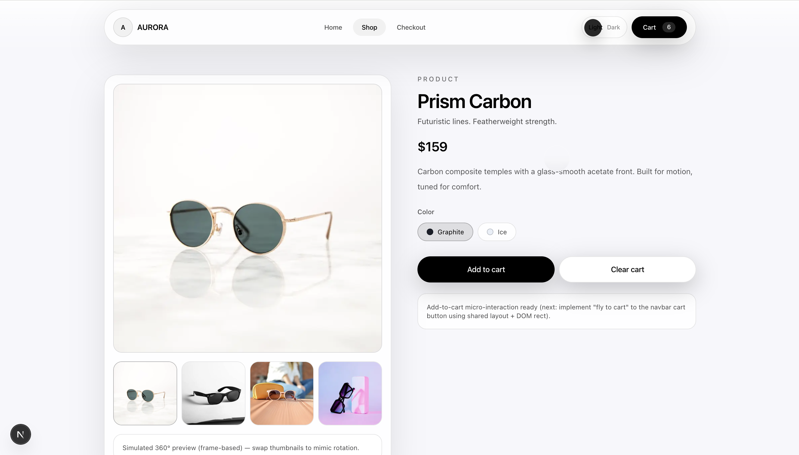
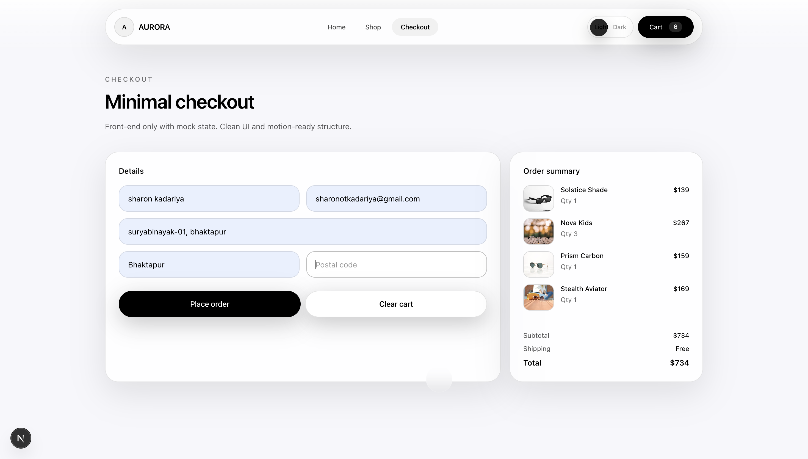

# Aurora Eyewear - E-Commerce Web Application

A modern, production-ready full-stack e-commerce web application for an eyeglasses brand. Built with Next.js, React, TypeScript, and Tailwind CSS, it delivers a smooth, responsive, and visually appealing shopping experience.
🚀 Live Demo: https://e-commerce-react-app-murex.vercel.app
💻 Local Dev: http://localhost:3000

## Overview

This project demonstrates modern frontend development practices by building a complete e-commerce platform with Next.js, React, TypeScript, and Tailwind CSS. It showcases real-world features including product browsing, cart management, checkout flow, and responsive design with dark/light mode support.

### Key Highlights
- **10 Unique Products** with high-quality imagery
- **Fully Responsive** mobile-first design
- **Dark/Light Theme** with smooth transitions
- **Shopping Cart** with Redux state management
- **Animated UI** using Framer Motion
- **Type-Safe** codebase with TypeScript

---

## Screenshots

### Landing Page

*Hero section with featured products and call-to-action*

### Products Page

*Product grid with filtering and quick view*

### Product Detail

*Product detail with image gallery and add to cart*

### Checkout

*Checkout form with order summary*

---

## Tech Stack

| Category | Technology |
|----------|------------|
| Framework | [Next.js 16](https://nextjs.org/) (App Router) |
| Language | [TypeScript](https://www.typescriptlang.org/) |
| Styling | [Tailwind CSS v4](https://tailwindcss.com/) |
| State Management | [Redux Toolkit](https://redux-toolkit.js.org/) |
| Animations | [Framer Motion](https://www.framer.com/motion/) |
| Icons | [Lucide React](https://lucide.dev/) |
| Theme | [next-themes](https://github.com/pacocoursey/next-themes) |

---

## Features

### E-Commerce
- Product catalog with 10 unique eyeglasses
- Category filtering (Men, Women, Kids, Sunglasses, Premium)
- Product detail pages with image galleries
- Shopping cart with add/remove/quantity controls
- Checkout flow with order confirmation

### UI/UX
- Responsive design (mobile, tablet, desktop)
- Dark/Light mode toggle
- Smooth page transitions and micro-interactions
- Glassmorphism design aesthetic
- Mobile-friendly navigation

### Technical
- Type-safe components with TypeScript
- Component-based architecture
- Redux for global state management
- Custom hooks for cart operations
- SEO-friendly with Next.js App Router

## Project Structure

```
app/                          # Next.js App Router
├── checkout/                 # Checkout page
│   └── page.tsx
├── products/                 # Products section
│   ├── page.tsx              # Product grid (shop page)
│   └── [handle]/             # Dynamic product detail route
│       └── page.tsx
├── globals.css               # Global styles + Tailwind
├── layout.tsx                # Root layout with providers
├── page.tsx                  # Home/Landing page
└── providers.tsx             # App providers wrapper

components/                   # React components
├── layout/                   # Layout components
│   ├── AppShell.tsx          # App shell wrapper
│   ├── Container.tsx         # Max-width container
│   ├── Navbar.tsx            # Navigation bar
│   └── ThemeToggle.tsx       # Dark/light mode toggle
├── providers/                # Context providers
│   └── AppProviders.tsx      # Theme + Redux providers
├── sections/                 # Page sections
│   └── LandingHero.tsx       # Hero section
├── shop/                     # E-commerce components
│   ├── CartDrawer.tsx        # Shopping cart drawer
│   ├── CheckoutPage.tsx      # Checkout form + success
│   ├── ProductDetail.tsx     # Product detail view
│   └── ProductsGrid.tsx      # Product grid with filters
└── ui/                       # Reusable UI components
    ├── Button.tsx            # Button with variants
    ├── Card.tsx              # Card container
    ├── Drawer.tsx            # Slide-out drawer
    └── Modal.tsx             # Dialog modal

features/                     # Redux slices
└── cart/
    └── cartSlice.ts          # Cart state management

hooks/                        # Custom React hooks
└── useCart.ts                # Cart hook

lib/                          # Utilities & data
├── format.ts                 # Currency formatting
├── products.ts               # Product data (10 products)
└── types.ts                  # TypeScript types

store/                        # Redux store
├── hooks.ts                  # Typed hooks
└── store.ts                  # Store configuration

animations/                   # Animation presets
└── motion.ts                 # Framer Motion variants
```

---

## Getting Started

### Prerequisites
- Node.js 18+ 
- npm or yarn

### Installation

```bash
# Navigate to project
cd /Users/sharonkadariya/Downloads/e-commerce

# Install dependencies
npm install

# Run development server
npm run dev

# Build for production
npm run build

```
---

## Future Enhancements

### Planned Features
1. **Cart Persistence**: localStorage for cart state
2. **Search**: Product search functionality
3. **User Auth**: Login/signup with accounts
4. **Wishlist**: Save favorites
5. **Reviews**: Product ratings and reviews
6. **Real Checkout**: Stripe/PayPal integration
7. **Admin Dashboard**: Product management
8. **Analytics**: Page tracking and conversion

### Performance Optimizations
- Image preloading for hero
- Lazy loading for product images
- Service worker for offline support
- Bundle size optimization

---
Made with Love by SHARON <3
